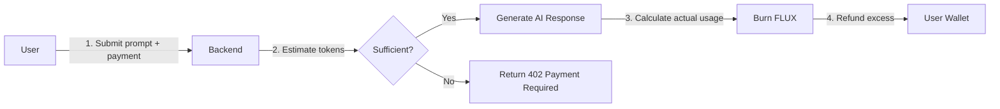
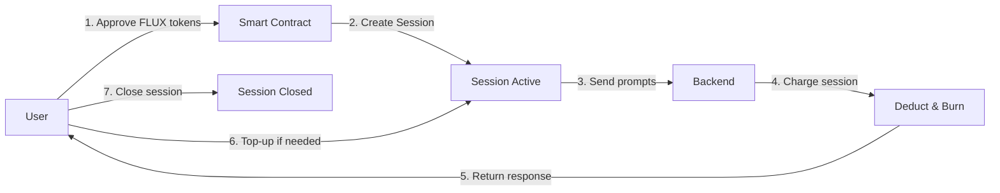
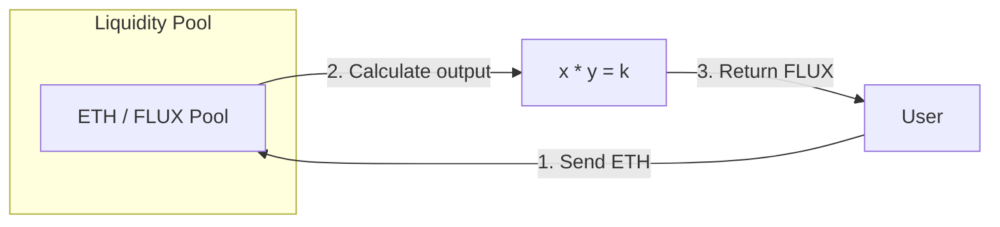
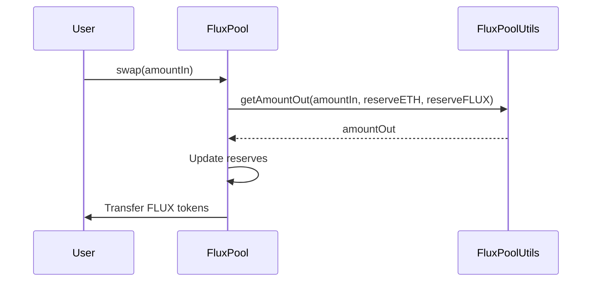
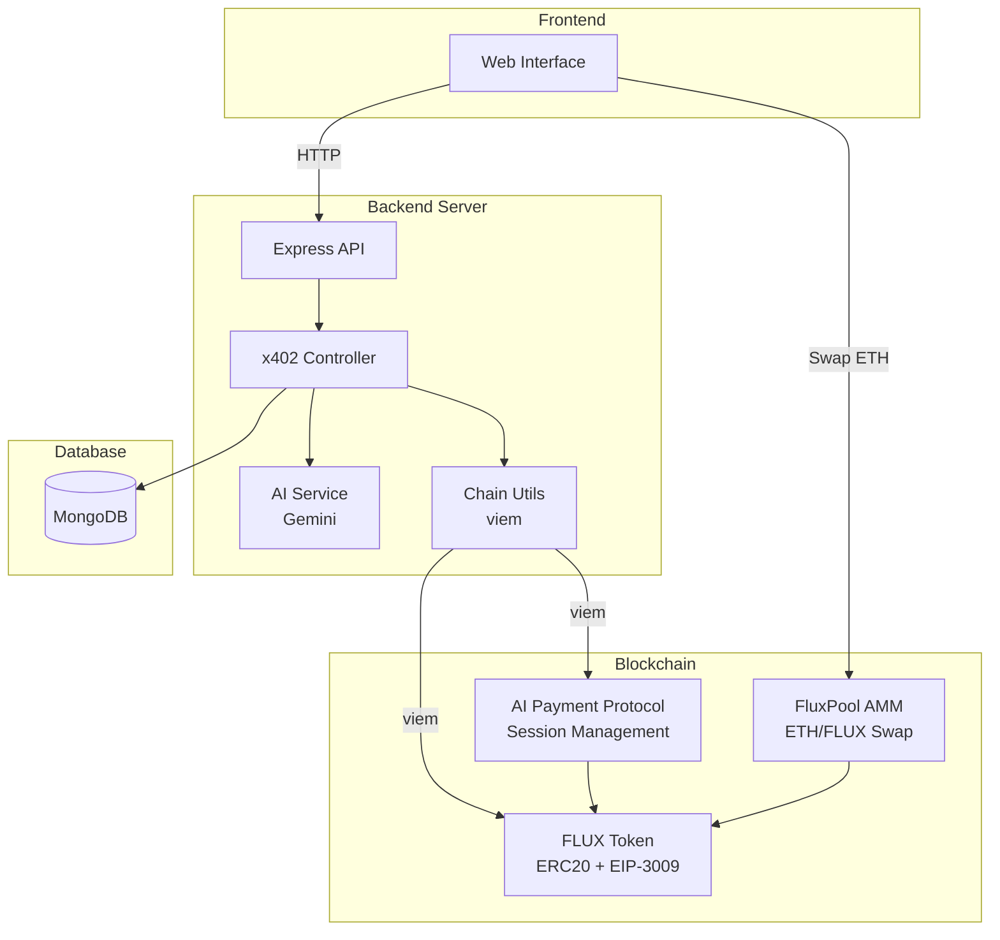
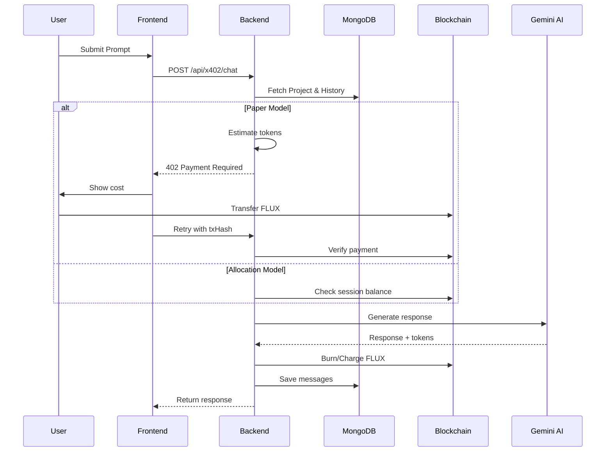
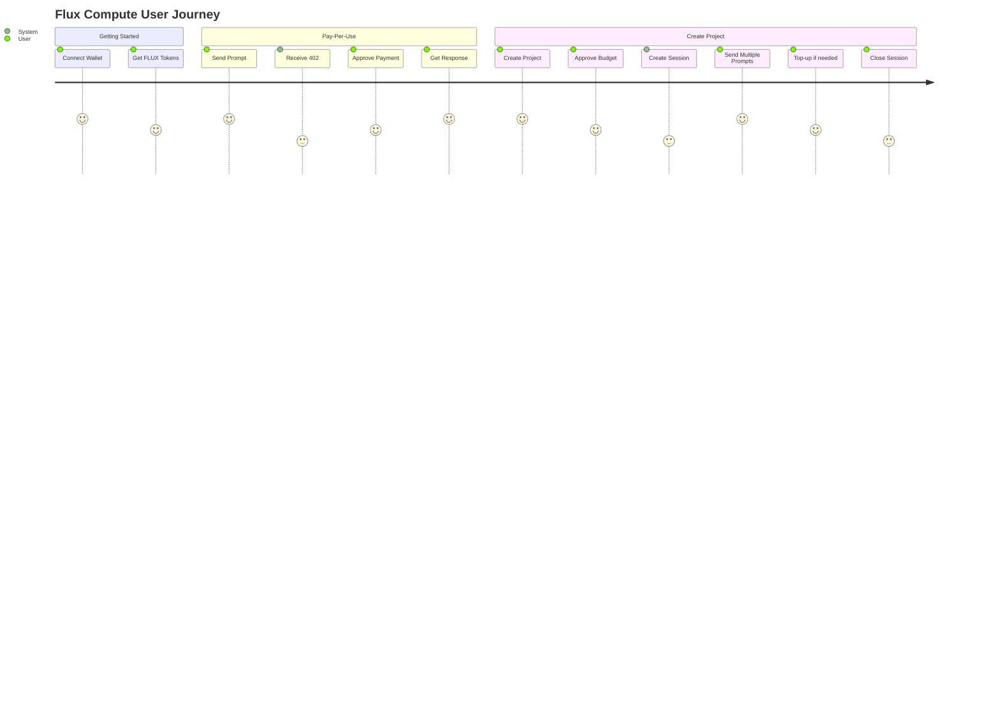

# Flux Compute

<p align="center">
  <b>Pay-as-you-go AI compute powered by blockchain</b>
</p>

> Flux Compute enables developers to access AI services with transparent, token-based payments. Pay only for what you use with on-chain settlement and automatic refunds.

---

## Quick Start (5 minutes)

### Prerequisites

- Node.js 18+
- npm or yarn
- MongoDB instance running locally or remote
- Ethereum wallet with test tokens
- Gemini API key

### Installation & Setup

```bash
# 1. Clone the repository
git clone https://github.com/your-username/flux-compute.git
cd flux-compute

# 2. Install backend dependencies
cd backend
npm install

# 3. Configure backend environment
cp .env.example .env
# Edit .env with your configuration (see Configuration section below)

# 4. Start backend server
npm run dev
# Server will start on http://localhost:3000

# 5. In a new terminal, install frontend dependencies
cd ../frontend
npm install

# 6. Start frontend development server
npm run dev
# Frontend will start on http://localhost:5173 (or your configured port)
```

### Configuration

Create a `.env` file in the `backend` directory:

```env
# Server
PORT=3000
CORS_ORIGIN=http://localhost:5173

# MongoDB
MONGO_URL=mongodb://localhost:27017/flux-compute

# AI Service
GEMINI_API_KEY=your_gemini_api_key_here

# Blockchain (Sepolia)
FLUX_TOKEN_ADDRESS=0xE16224cF844c9F1750487004FDe10C5c943BD948
AI_PAYMENT_PROTOCOL_ADDRESS=0x4A8B4AE5f4Af3b895b0B28117E4dA424CF96EF28
BACKEND_WALLET=0x3a57622F51356fB925081A6D048BAA3eC35D9bAe

# ⚠️ Development-only private key (not a security leak)
# This is a test/dev account required for local development
BACKEND_WALLET_PRIVATE_KEY=d8dfd0f29eb7b26bf3171d3bbee542f6702310e821da825847177efdec256eb8
```

### Running the Application

**Backend (Terminal 1):**
```bash
cd backend
npm run dev      # Development mode with hot reload
# npm start      # Production mode
```
Server runs on `http://localhost:3000`

**Frontend (Terminal 2):**
```bash
cd frontend
npm run dev      # Development mode
```
Frontend runs on `http://localhost:5173`

---

## Table of Contents

- [Quick Start](#quick-start-5-minutes)
- [Overview](#overview)
- [Key Features](#key-features)
- [Payment Models](#payment-models)
- [AMM: FLUX Token Exchange](#amm-flux-token-exchange)
- [Architecture](#architecture)
- [User Journey](#user-journey)
- [Tech Stack](#tech-stack)
- [Deep Dive: Capabilities](#deep-dive-capabilities)
- [Configuration](#configuration)
- [Screenshots](#screenshots)

---

## Overview

**Flux Compute** solves the problem of opaque, subscription-based AI pricing by providing a transparent, per-token billing system powered by blockchain technology. Users pay with FLUX tokens, and all transactions are verifiable on-chain.

The platform integrates the **x402 protocol** for payment verification, ensuring that:
- Users only pay for actual AI token usage
- Overpayments are automatically refunded
- All transactions are cryptographically verifiable

---

## Key Features

| Feature | Description |
|---------|-------------|
| **Token-Based Payments** | Pay with FLUX tokens for precise cost control |
| **Two Payment Models** | Choose between pay-per-request or pre-allocated budget sessions |
| **AMM Exchange** | Swap ETH for FLUX tokens using a Uniswap-style liquidity pool |
| **Automatic Refunds** | Overpayments are refunded automatically |
| **On-Chain Verification** | All payments settled and verifiable on blockchain |
| **EIP-3009 Support** | Gasless transactions for seamless UX |
| **Session Management** | Create, top-up, and close payment sessions |

---

## Payment Models

Flux Compute offers **two distinct payment models** to accommodate different use cases:

### 1. Pay-Per-Use ("Paper" Model)



**How it works:**
1. User sends a prompt with a payment transaction hash
2. Backend estimates required tokens and verifies payment
3. AI generates response, actual token count is calculated
4. Exact cost is burned; excess is refunded to user

**Best for:** One-off requests, testing, or infrequent usage.

---

### 2. Create Project (Allocation Model)



**How it works:**
1. User approves a budget of FLUX tokens for the session
2. A session is created on-chain with the authorized amount
3. Each prompt deducts from the session balance
4. User can top-up or close the session at any time
5. Unused funds remain in user's wallet (not transferred until used)

**Best for:** Projects, applications, or ongoing development.

---

## AMM: FLUX Token Exchange

Flux Compute includes an **Automated Market Maker (AMM)** that enables users to swap ETH for FLUX tokens directly, using a Uniswap-style constant product formula.

### How the AMM Works



### Constant Product Formula

The AMM uses the proven **x * y = k** formula with a **0.3% fee**:

```
Amount Out = (amountIn * 997 * reserveOut) / (reserveIn * 1000 + amountIn * 997)
```

| Parameter | Description |
|-----------|-------------|
| `amountIn` | Amount of tokens being swapped in |
| `reserveIn` | Current reserve of input token |
| `reserveOut` | Current reserve of output token |
| `997/1000` | 0.3% fee applied to swaps |

### AMM Utility Functions

```solidity
// Get output amount for a given input
function getAmountOut(
    uint256 amountIn, 
    uint256 reserveIn, 
    uint256 reserveOut
) returns (uint256)

// Get required input for a desired output
function getAmountIn(
    uint256 amountOut, 
    uint256 reserveOut, 
    uint256 reserveIn
) returns (uint256)
```

### Swap Flow



---

## Architecture

### System Overview



### Server Process Flow



---

## User Journey

### New User Onboarding



<!-- 
### Screenshots

Add your screenshots here:


-->

---

## Tech Stack

| Layer | Technology | Purpose |
|-------|------------|---------|
| **Frontend** | React/Next.js | Web interface |
| **Backend** | Node.js + Express | API server |
| **Database** | MongoDB + Mongoose | Data persistence |
| **AI** | Google Gemini | LLM responses |
| **Blockchain** | Ethereum (Sepolia) | Payment settlement |
| **Web3** | viem | Blockchain interaction |
| **Smart Contracts** | Solidity | FLUX token + Payment protocol |

---

## Deep Dive: Capabilities

### 1. **x402 Payment Protocol**
Implements the HTTP 402 Payment Required standard for machine-to-machine payments:
- **Verify**: Estimate cost and check user balance
- **Post**: Execute payment and generate response
- **Settle**: Calculate actual usage and process refunds

### 2. **EIP-3009 Gasless Transactions**
Users can authorize payments without paying gas fees:
- `transferWithAuthorization` - Third-party initiated transfers
- `receiveWithAuthorization` - Pull-based payment authorization
- Signature-based authorization with time bounds

### 3. **Session Management**
For the allocation model:
- Create sessions with pre-approved budgets
- Real-time balance tracking
- Top-up existing sessions
- Close sessions to release unused funds

### 4. **Token Economics**
- **Conversion Rate**: 1 FLUX = 100 AI Tokens
- **Burn Mechanism**: Used FLUX is permanently burned
- **Refund System**: Automatic refunds for overestimates

### 5. **AMM Liquidity Pool**
- **Uniswap V2 Style**: Constant product (x*y=k) formula
- **0.3% Swap Fee**: Standard DeFi fee structure
- **Bidirectional**: Swap ETH→FLUX or FLUX→ETH
- **Price Discovery**: Automatic pricing based on reserves

### 6. **AI Integration**
- Supports multiple Gemini models (auto-fallback)
- Context-aware conversations (maintains chat history)
- Token usage tracking per message

---


## API Reference

See [Backend Documentation](./backend/README.md) for detailed API documentation.

## x402 Protocol

See [X402 Documentation](./x402/README.md) for detailed protocol documentation.

---


<p align="center">
  Built with ❤️ by the Flux Compute Team
</p>
