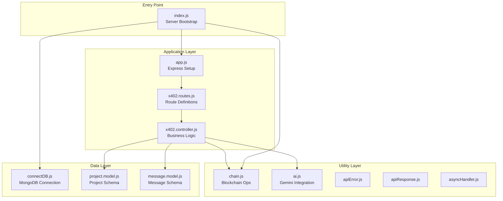
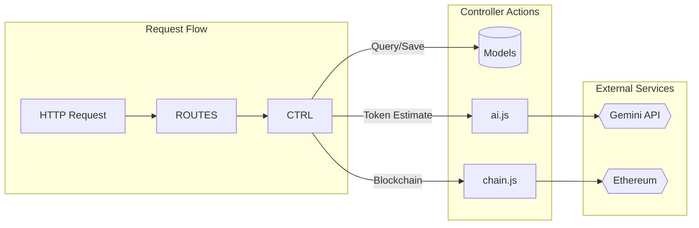
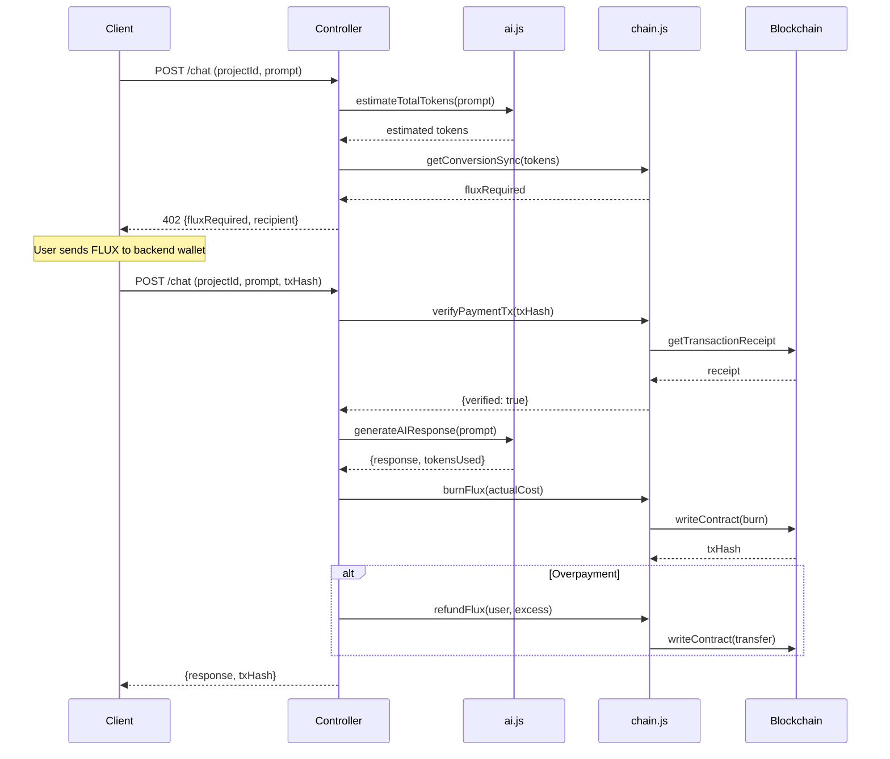
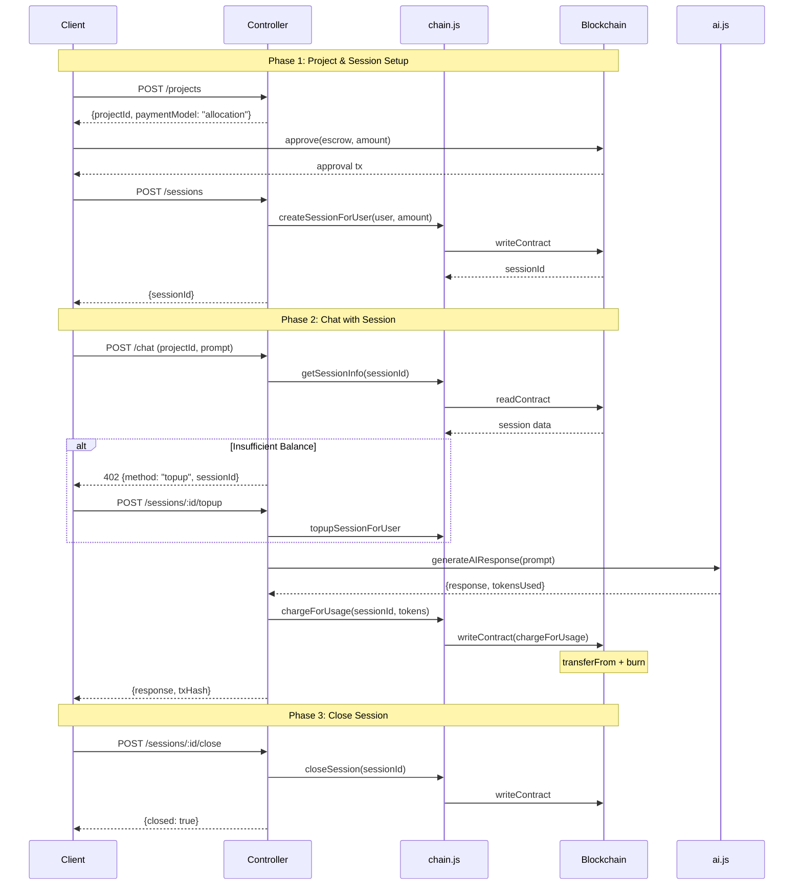
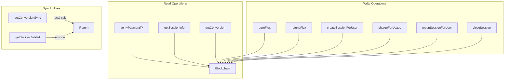

# Flux Compute Backend

Backend server for Flux Compute - a blockchain-powered AI payment system using the x402 protocol.

---

## Table of Contents

- [Architecture](#architecture)
- [Directory Structure](#directory-structure)
- [File Roles](#file-roles)
- [Payment Flows](#payment-flows)
- [API Endpoints](#api-endpoints)
- [Running the Server](#running-the-server)

---

## Architecture



---

## Directory Structure

```
backend/
├── src/
│   ├── index.js              # Application entry point
│   ├── app.js                # Express app configuration
│   ├── constants.js          # Database name constant
│   │
│   ├── controllers/
│   │   └── x402.controller.js    # Main business logic
│   │
│   ├── routes/
│   │   └── x402.routes.js        # API route definitions
│   │
│   ├── models/
│   │   ├── project.model.js      # Project schema
│   │   └── message.model.js      # Message schema
│   │
│   ├── db/
│   │   └── connectDB.js          # MongoDB connection
│   │
│   └── utils/
│       ├── chain.js              # Blockchain interactions
│       ├── ai.js                 # Gemini AI integration
│       ├── apiError.js           # Error class
│       ├── apiResponse.js        # Response class
│       └── asyncHandler.js       # Async error wrapper
│
├── package.json
└── public/                   # Static files
```

---

## File Roles

### Core Files

| File | Role | Dependencies |
|------|------|--------------|
| `index.js` | Bootstrap server, connect DB, ensure conversion rate | `app.js`, `connectDB.js`, `chain.js` |
| `app.js` | Express middleware, route mounting, error handling | `x402.routes.js` |

### Controllers

| File | Role | Key Functions |
|------|------|---------------|
| `x402.controller.js` | All business logic | `chat()`, `createProject()`, `createSession()`, `topupSession()`, `closeSessionEndpoint()` |

### Models

| File | Schema | Key Fields |
|------|--------|------------|
| `project.model.js` | Project | `projectId`, `ownerAddress`, `paymentModel`, `sessionId`, `name` |
| `message.model.js` | Message | `projectId`, `role`, `content`, `tokensUsed`, `burnTxHash` |

### Utilities

| File | Role | Exports |
|------|------|---------|
| `chain.js` | All blockchain operations | `burnFlux()`, `refundFlux()`, `createSessionForUser()`, `chargeForUsage()`, `getSessionInfo()` |
| `ai.js` | Gemini AI integration | `generateAIResponse()`, `estimateRequestTokens()`, `estimateTotalTokens()` |

---

## File Interactions



---

## Payment Flows

### Flow 1: Pay-Per-Use ("Paper" Model)



**Key Points:**
- Initial request returns 402 with cost estimate
- User transfers FLUX to backend wallet
- Backend verifies transfer on-chain
- Actual usage is burned, excess is refunded

---

### Flow 2: Create Project (Allocation Model)



**Key Points:**
- User creates project with `allocation` payment model
- User approves FLUX and creates session on-chain
- Each chat deducts from session (no per-request payment)
- Top-up if balance insufficient
- Close session when done

---

## Controller Functions

### chat()
The main endpoint handling both payment models:

```javascript
// Paper Model Flow
if (project.paymentModel === "paper") {
    if (!paymentTxHash) → 402 Payment Required
    verify payment → generate AI → burn actual → refund excess
}

// Allocation Model Flow  
if (project.paymentModel === "allocation") {
    check session balance → if insufficient → 402 topup required
    generate AI → chargeForUsage(sessionId, tokens)
}
```

### Session Functions

| Function | Description |
|----------|-------------|
| `createSession()` | Initialize session on-chain |
| `getSession()` | Retrieve session balance/status |
| `topupSession()` | Add more FLUX to session |
| `closeSessionEndpoint()` | Deactivate session |

---

## API Endpoints

### Projects

| Method | Endpoint | Description |
|--------|----------|-------------|
| `POST` | `/api/x402/projects` | Create new project |
| `GET` | `/api/x402/projects` | List user's projects |
| `GET` | `/api/x402/projects/:id` | Get project details |
| `DELETE` | `/api/x402/projects/:id` | Delete project |
| `GET` | `/api/x402/projects/:id/messages` | Get chat history |

### Chat

| Method | Endpoint | Description |
|--------|----------|-------------|
| `POST` | `/api/x402/chat` | Send prompt (handles payment) |

### Sessions

| Method | Endpoint | Description |
|--------|----------|-------------|
| `POST` | `/api/x402/sessions` | Create session |
| `GET` | `/api/x402/sessions/:id` | Get session info |
| `POST` | `/api/x402/sessions/:id/topup` | Top-up session |
| `POST` | `/api/x402/sessions/:id/close` | Close session |

---

## Chain Utility Functions



### Transaction Mutex
All write operations use a mutex lock to serialize transactions and prevent nonce conflicts:

```javascript
const txLock = new Mutex();

// All blockchain writes wrapped in:
return txLock.runExclusive(async () => {
    // transaction logic
});
```

---

## Running the Server

```bash
# Development
npm run dev

# Production
npm start
```

Server starts on configured PORT (default: 3000).

### Startup Sequence

1. Load environment variables
2. Connect to MongoDB
3. Sync conversion rate with smart contract
4. Start Express server

---

## Error Handling

All errors return JSON:

```json
{
    "success": false,
    "error": "Error message"
}
```

Common status codes:
- `400` - Bad request / validation error
- `402` - Payment required
- `404` - Resource not found
- `500` - Server error
