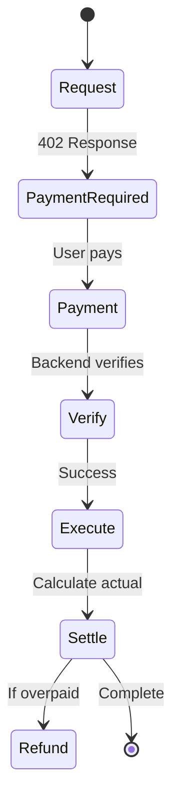
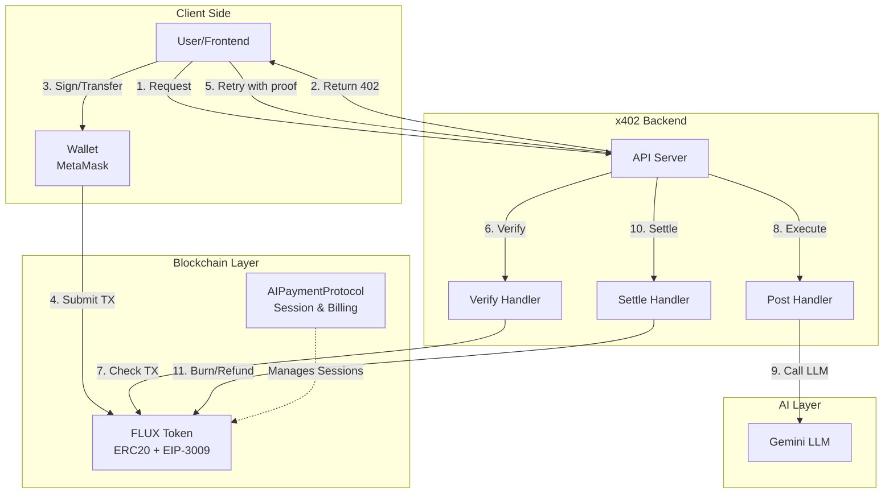
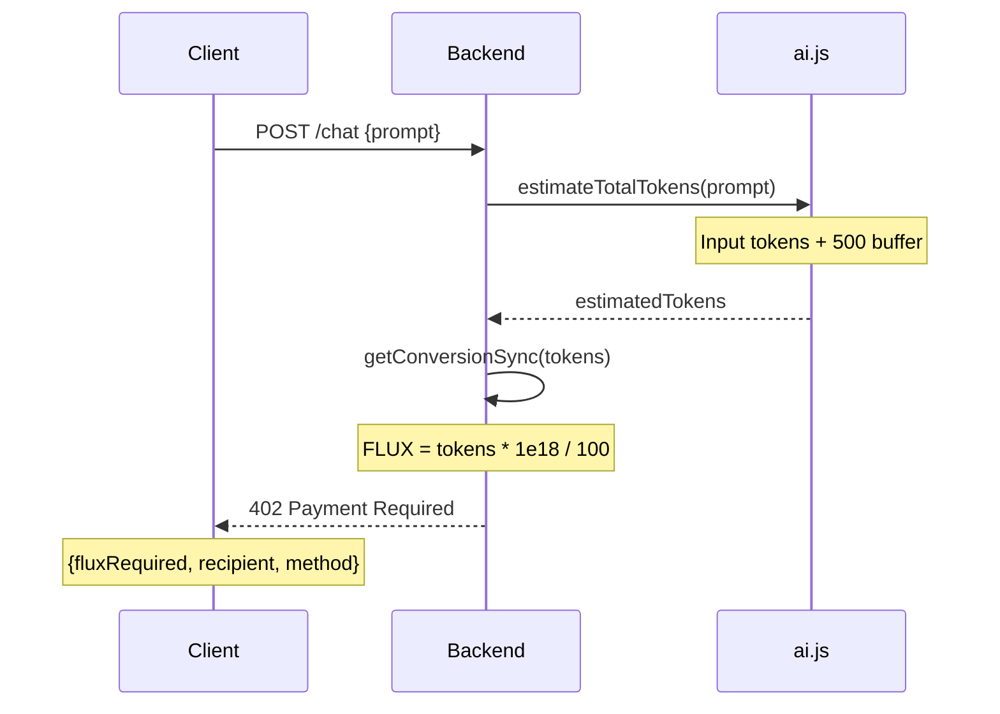
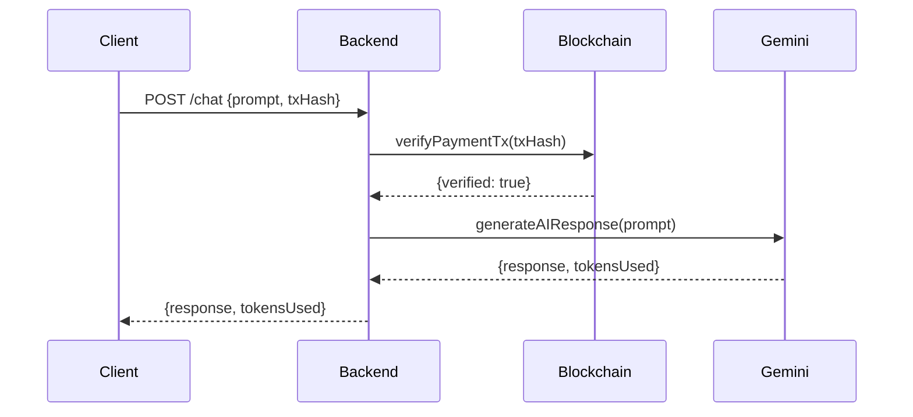
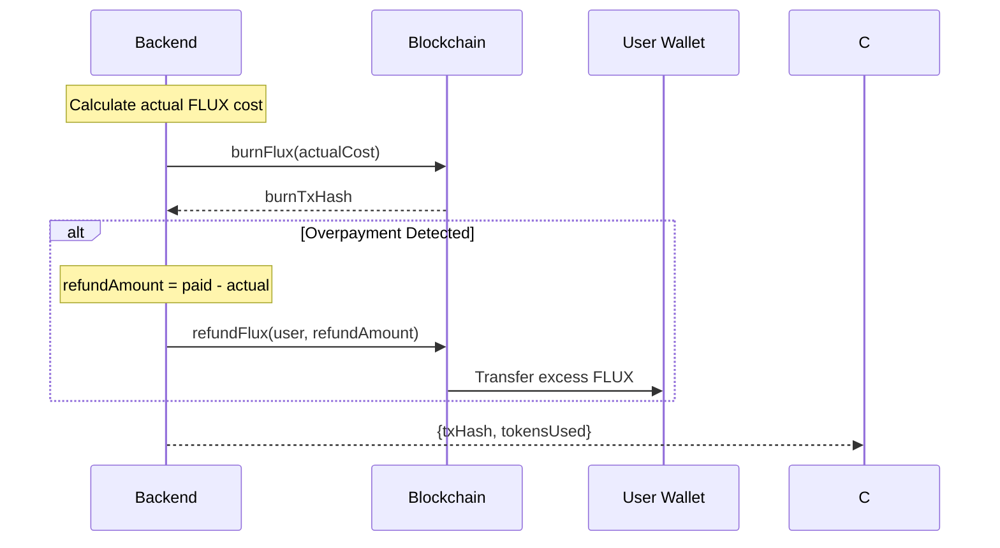
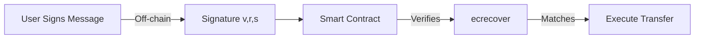
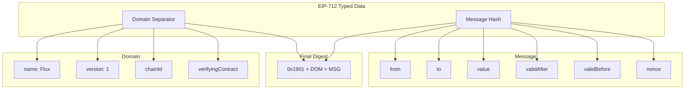
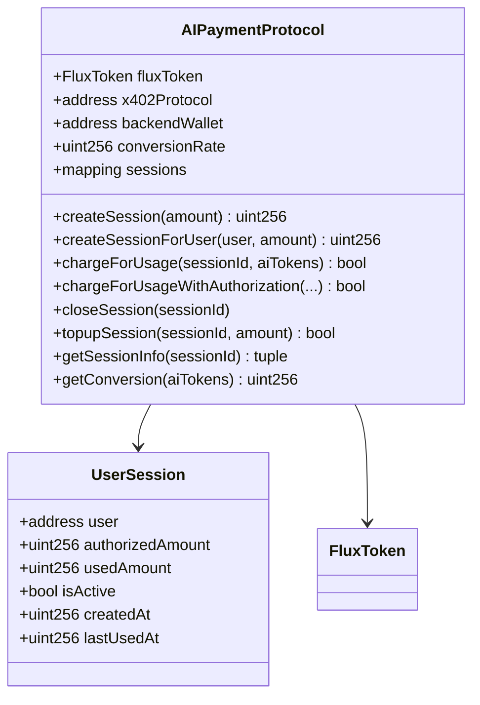
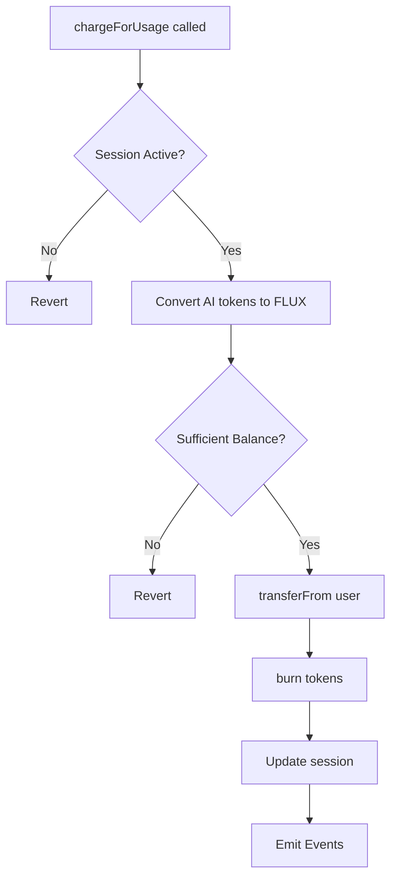
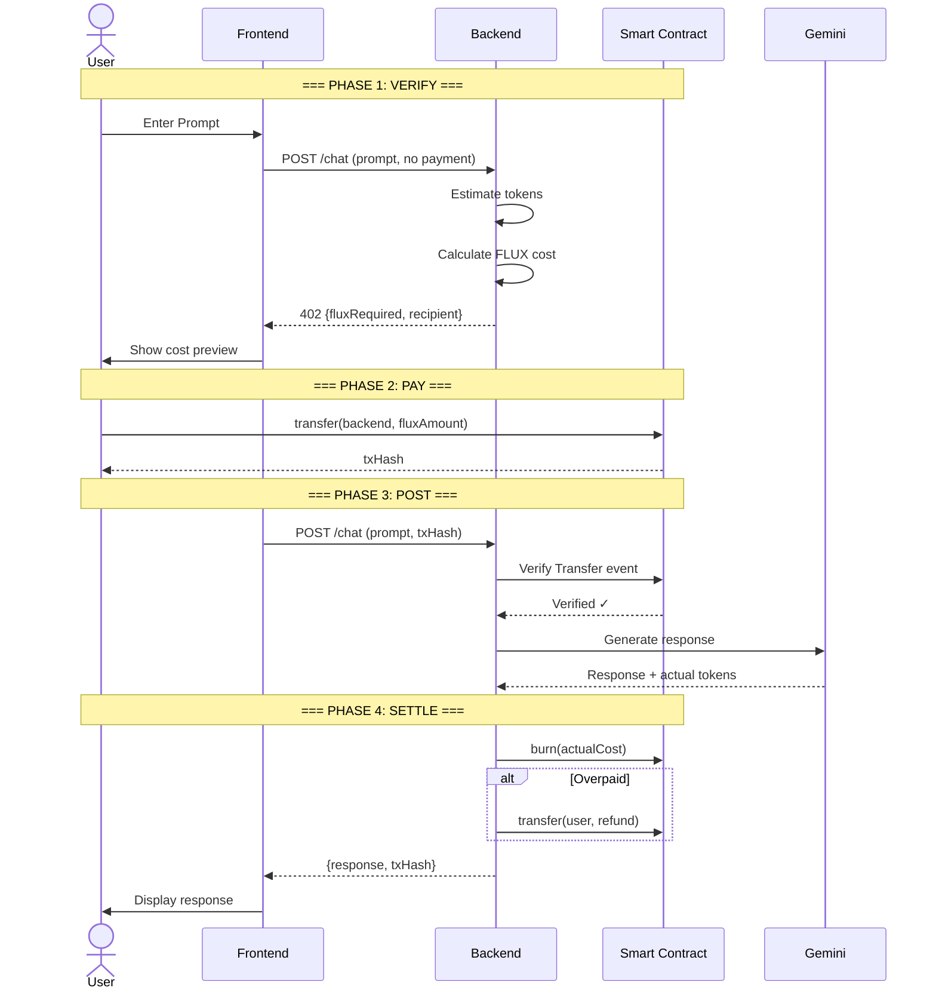

# x402 Protocol - Complete Technical Documentation

The definitive guide to the x402 payment protocol implementation in Flux Compute.

---

## Table of Contents

1. [Overview](#overview)
   - [What is x402?](#what-is-x402)
   - [Core Principles](#core-principles)
   - [Protocol Lifecycle](#protocol-lifecycle)
2. [Architecture](#architecture)
   - [System Diagram](#system-diagram)
   - [Implementation Modes](#implementation-modes)
   - [Key Files](#key-files)
3. [The 402 Payment Flow](#the-402-payment-flow)
   - [Phase 1: VERIFY (Cost Estimation)](#phase-1-verify-cost-estimation)
   - [Phase 2: POST (Payment & Execution)](#phase-2-post-payment--execution)
   - [Phase 3: SETTLE (Burn & Refund)](#phase-3-settle-burn--refund)
4. [Verification Process](#verification-process)
   - [Direct x402 (Pay-Per-Request)](#direct-x402-pay-per-request)
   - [Session-Based x402](#session-based-x402)
   - [Middleware Implementation](#middleware-implementation)
5. [Cryptographic Signing](#cryptographic-signing)
   - [EIP-712 Signature Verification](#eip-712-signature-verification)
   - [EIP-3009 Gasless Transfers](#eip-3009-gasless-transfers)
   - [Signature Structure](#signature-structure)
6. [Token Economics](#token-economics)
   - [Conversion Rate](#conversion-rate)
   - [Token Estimation](#token-estimation)
7. [Smart Contracts](#smart-contracts)
   - [AIPaymentProtocol (Escrow)](#aipaymentprotocol-escrow)
   - [FluxToken](#fluxtoken)
   - [chargeForUsage Flow](#chargeforusage-flow)
8. [Code Reference](#code-reference)
   - [402 Response Generation](#402-response-generation)
   - [Payment Verification](#payment-verification)
   - [Burn and Refund Logic](#burn-and-refund-logic)
9. [Security](#security)
   - [Security Checks Summary](#security-checks-summary)
10. [API Reference](#api-reference)

---

## Overview

### What is x402?

**x402** is a protocol for machine-to-machine payments based on the HTTP 402 "Payment Required" status code. It enables services to request payment programmatically before providing access to resources.

**Core Concept:** When a client makes a request without payment, the server returns a `402 Payment Required` response with payment instructions. The client pays on-chain, then retries with proof of payment.

> HTTP 402 has been reserved since 1997 but was never widely adopted because there was no good way to pay on the internet. Crypto changes that - now we can finally use 402 as intended.

### Core Principles

| Principle | Description |
|-----------|-------------|
| **Transparent Pricing** | Cost shown upfront before commitment |
| **Atomic Transactions** | Payment and service are linked |
| **Fair Accounting** | Pay only for what you use |
| **On-Chain Settlement** | Verifiable transaction records |

### Protocol Lifecycle



---

## Architecture

### System Diagram



### Implementation Modes

The codebase has **two x402 implementations**:

| Implementation | File | Payment Model | Best For |
|----------------|------|---------------|----------|
| **Session-Based** | `X402Service.js` | Pre-authorized spending limit | Conversations |
| **Direct Pay-Per-Request** | `x402-direct.js` | Pay each request individually | Single questions |

### Key Files

| File | Purpose |
|------|---------|
| `middleware/x402.js` | Reusable middleware for any endpoint |
| `services/X402Service.js` | Session-based verify → post → settle |
| `routes/x402-direct.js` | Direct pay-per-request implementation |
| `services/MockFacilitator.js` | EIP-712 signature verification |
| `contracts/EscrowContract.js` | Smart contract wrapper |
| `utils/tokenCounter.js` | AI token estimation |

---

## The 402 Payment Flow

### Phase 1: VERIFY (Cost Estimation)

When a user submits a prompt without payment, the server returns a **402 Payment Required** response.



**402 Response Format:**

```json
{
    "success": false,
    "error": "Payment Required",
    "payment": {
        "fluxRequired": "5000000000000000000",
        "estimatedTokens": 500,
        "recipient": "0x...",
        "method": "transfer"
    }
}
```

### Phase 2: POST (Payment & Execution)

After the user pays, they retry with proof of payment.



### Phase 3: SETTLE (Burn & Refund)

After execution, actual usage is calculated and settled.



---

## Verification Process

### Direct x402 (Pay-Per-Request)

**Location:** `backend/src/routes/x402-direct.js`

**Flow:**
```
User Request → Check for Payment Header → If None: Return 402 → If Exists: Verify → Execute AI
```

#### Step 1: Check for Payment Header

```javascript
const paymentTxHash = req.headers['x-payment-tx'];

if (!paymentTxHash) {
  return res.status(402).json({
    error: 'Payment Required',
    payment: {
      requestId,
      amount: '100 FLUX',
      contract: X402_CONTRACT,
      method: 'payForRequest'
    }
  });
}
```

#### Step 2: Verification Checks

| Step | What is Checked | How It's Verified |
|------|-----------------|-------------------|
| 1. Double-spend check | Was this TX already used? | In-memory `Set` lookup |
| 2. TX exists | Does the transaction exist on-chain? | `client.getTransactionReceipt()` |
| 3. TX succeeded | Did the transaction complete successfully? | `receipt.status === 'success'` |
| 4. Correct contract | Was payment sent to our contract? | Compare `receipt.to` with expected address |

```javascript
// Get transaction receipt from blockchain
receipt = await client.getTransactionReceipt({ hash: paymentTxHash });

// Check 1: TX succeeded
if (!receipt || receipt.status !== 'success') {
  return res.status(402).json({ error: 'Transaction failed or pending' });
}

// Check 2: Correct recipient contract
if (receipt.to?.toLowerCase() !== X402_CONTRACT?.toLowerCase()) {
  return res.status(402).json({ error: 'Payment sent to wrong contract' });
}

// If all checks pass, mark as processed to prevent reuse
processedPayments.add(paymentTxHash);
```

---

### Session-Based x402

**Location:** `backend/src/services/X402Service.js`

A more sophisticated 3-phase approach: **VERIFY → POST → SETTLE**

#### Phase 1: VERIFY

```javascript
async function verify(sessionId, messages, options = {}) {
  // 1. Check session is active
  const sessionInfo = await escrowContract.getSessionInfo(sessionId);
  if (!sessionInfo.isActive) throw new Error('Session is not active');

  // 2. Estimate AI tokens needed
  const { totalTokens: estimatedAiTokens } = estimateRequestTokens(messages, maxTokens, model);
  
  // 3. Convert to FLUX cost
  const fluxNeeded = await escrowContract.getConversion(estimatedAiTokens);

  // 4. Check session has sufficient balance
  const remaining = BigInt(sessionInfo.remainingAmount);
  if (remaining < fluxNeeded) throw new Error('Insufficient session balance');

  // 5. Check user has sufficient allowance
  const allowance = await escrowContract.getUserAllowance(sessionInfo.user);
  if (allowance < fluxNeeded) throw new Error('Insufficient FLUX allowance');

  // 6. Create payment ID for tracking
  const paymentId = createPaymentId();
  payments.set(paymentId, { sessionId, estimatedAiTokens, userAddress: sessionInfo.user });

  return { paymentId, estimatedCost: fluxNeeded.toString() };
}
```

#### Phase 2: POST

```javascript
async function post(paymentId, messages, options = {}) {
  const pay = payments.get(paymentId);
  if (!pay) throw new Error('Invalid or expired paymentId');

  // Charge on-chain (pulls FLUX from user, burns it)
  const receipt = await escrowContract.chargeForUsage(pay.sessionId, pay.estimatedAiTokens);

  // Call AI service
  const ai = await aiService.generateResponse(messages, options);

  return {
    response: ai.response,
    usage: ai.usage,
    transaction: { txHash: receipt.hash, blockNumber: receipt.blockNumber }
  };
}
```

#### Phase 3: SETTLE

```javascript
async function settle(paymentId, actualTokensUsed) {
  const pay = payments.get(paymentId);
  
  // Calculate overcharge
  const refundAi = Math.max(0, Number(pay.estimatedAiTokens) - Number(actualTokensUsed));
  
  if (refundAi === 0) return { refund: '0', status: 'ok' };

  // Convert to FLUX and refund
  const refundFlux = await escrowContract.getConversion(refundAi);
  await fluxToken.transfer(pay.userAddress, refundFlux);
  
  return { refund: refundFlux.toString(), status: 'ok' };
}
```

---

### Middleware Implementation

**Location:** `backend/src/middleware/x402.js`

```javascript
function requireX402Payment(price, metadata = {}) {
  return async (req, res, next) => {
    const paymentHeader = req.get('X-Payment-Signature');
    
    if (!paymentHeader) {
      const challenge = generateChallenge(price, metadata);
      return res.status(402).json({
        error: 'Payment Required',
        payment: challenge
      });
    }
    
    // Verify payment signature
    const payment = JSON.parse(paymentHeader);
    const challenge = challenges.get(payment.nonce);
    const verified = await mockFacilitator.verify(payment, challenge);
    
    if (!verified.valid) {
      return res.status(402).json({ error: 'Payment verification failed' });
    }
    
    req.x402Payment = verified;
    next();
  };
}
```

#### Challenge Generation

```javascript
function generateChallenge(price, metadata = {}) {
  const nonce = crypto.randomBytes(16).toString('hex');
  const challenge = {
    nonce,
    price: price.toString(),
    currency: 'FLUX',
    network: 'eip155:11155111', // Sepolia
    recipient: config.blockchain.escrowAddress,
    timestamp: Date.now(),
    metadata
  };
  
  challenges.set(nonce, challenge);
  setTimeout(() => challenges.delete(nonce), 5 * 60 * 1000); // 5 min expiry
  
  return challenge;
}
```

---

## Cryptographic Signing

### EIP-712 Signature Verification

**Location:** `backend/src/services/MockFacilitator.js`

```javascript
async verify(payment, challenge) {
  const { signature, from, amount, nonce, timestamp } = payment;
  
  // 1. Replay protection
  if (this.payments.has(nonce)) {
    return { valid: false, reason: 'Payment already processed' };
  }
  
  // 2. Time window check (5 minutes)
  const now = Math.floor(Date.now() / 1000);
  if (Math.abs(now - timestamp) > 300) {
    return { valid: false, reason: 'Payment expired' };
  }
  
  // 3. Amount must match
  if (amount !== challenge.price) {
    return { valid: false, reason: 'Amount mismatch' };
  }
  
  // 4. Recover signer from signature
  const recovered = await this.recoverSigner(payment, challenge);
  
  // 5. Verify signer matches claimed sender
  if (recovered.toLowerCase() !== from.toLowerCase()) {
    return { valid: false, reason: 'Invalid signature' };
  }
  
  return { valid: true, txHash: generateTxHash() };
}
```

#### EIP-712 Domain & Types

```javascript
const domain = {
  name: 'x402 Payment',
  version: '1',
  chainId: 11155111,  // Sepolia
  verifyingContract: recipientAddress
};

const types = {
  Payment: [
    { name: 'nonce', type: 'string' },
    { name: 'amount', type: 'string' },
    { name: 'currency', type: 'string' },
    { name: 'recipient', type: 'address' },
    { name: 'timestamp', type: 'uint256' }
  ]
};

const recovered = ethers.verifyTypedData(domain, types, message, signature);
```

---

### EIP-3009 Gasless Transfers

The FLUX token supports gasless transfers through signed authorizations:



#### transferWithAuthorization

```solidity
function transferWithAuthorization(
    address from,
    address to,
    uint256 value,
    uint256 validAfter,
    uint256 validBefore,
    bytes32 nonce,
    uint8 v,
    bytes32 r,
    bytes32 s
) external {
    require(block.timestamp > validAfter, "Authorization not yet valid");
    require(block.timestamp < validBefore, "Authorization expired");
    require(!authorizationState[from][nonce], "Authorization already used");

    bytes32 digest = keccak256(abi.encodePacked(
        "\x19\x01",
        DOMAIN_SEPARATOR,
        keccak256(abi.encode(
            TRANSFER_WITH_AUTHORIZATION_TYPEHASH,
            from, to, value, validAfter, validBefore, nonce
        ))
    ));

    address signer = ecrecover(digest, v, r, s);
    require(signer == from, "Invalid signature");
    
    authorizationState[from][nonce] = true;
    balanceOf[from] -= value;
    balanceOf[to] += value;
}
```

---

### Signature Structure



---

## Token Economics

### Conversion Rate

```
1 FLUX = 100 AI Tokens
```

**Backend Implementation:**

```javascript
const RATE = 100n

export function getConversionSync(aiTokens) {
    const t = BigInt(aiTokens)
    const decimals = 1000000000000000000n // 1e18
    return (t * decimals) / RATE
}
```

**Smart Contract Implementation:**

```solidity
function getConversion(uint256 aiTokensUsed) public view returns (uint256) {
    return (aiTokensUsed + conversionRate - 1) / conversionRate;
}
```

### Token Estimation

```javascript
function estimateTokens(text) {
  // ~4 characters per token
  return Math.ceil(text.length / 4);
}

function estimateRequestTokens(messages, maxTokens = 4096) {
  let inputTokens = 0;
  
  for (const msg of messages) {
    inputTokens += estimateTokens(msg.content) + 4;
  }
  inputTokens += 100; // Response overhead
  
  const outputTokens = Math.min(maxTokens, Math.max(500, Math.ceil(inputTokens / 2)));
  
  return { inputTokens, outputTokens, totalTokens: inputTokens + outputTokens };
}
```

---

## Smart Contracts

### AIPaymentProtocol (Escrow)



### chargeForUsage Flow



```solidity
function chargeForUsage(uint256 sessionId, uint256 aiTokensUsed) 
    external 
    onlyX402 
    returns (bool) 
{
    UserSession storage session = sessions[sessionId];
    
    require(session.isActive, "Session not active");
    require(aiTokensUsed > 0, "Usage must be > 0");

    uint256 fluxAmount = getConversion(aiTokensUsed);
    require(fluxAmount > 0, "Flux amount must be > 0");

    uint256 remainingAuthorized = session.authorizedAmount - session.usedAmount;
    require(fluxAmount <= remainingAuthorized, "Insufficient authorized amount");

    bool transferSuccess = fluxToken.transferFrom(session.user, address(this), fluxAmount);
    require(transferSuccess, "Token transfer failed");

    fluxToken.burn(fluxAmount);

    session.usedAmount += fluxAmount;
    session.lastUsedAt = block.timestamp;

    emit TokensCharged(sessionId, session.user, fluxAmount, aiTokensUsed);
    emit TokensBurned(sessionId, fluxAmount);

    return true;
}
```

### FluxToken Burn

```solidity
function burn(uint256 amount) external {
    require(balanceOf[msg.sender] >= amount, "Insufficient balance");
    balanceOf[msg.sender] -= amount;
    totalSupply -= amount;
    emit Transfer(msg.sender, address(0), amount);
}
```

---

## Code Reference

### 402 Response Generation

```javascript
export async function chat(req, res) {
    const { projectId, prompt, paymentTxHash } = req.body
    
    const project = await Project.findOne({ projectId })
    const estimatedTokens = estimateTotalTokens(prompt)
    const fluxRequired = getConversionSync(estimatedTokens)
    
    if (project.paymentModel === "paper") {
        if (!paymentTxHash) {
            return res.status(402).json({
                success: false, 
                error: "Payment Required",
                payment: {
                    fluxRequired: fluxRequired.toString(),
                    estimatedTokens,
                    recipient: getBackendWallet(),
                    method: "transfer"
                }
            })
        }
    }
}
```

### Payment Verification

```javascript
export async function verifyPaymentTx(txHash, expectedAmount, sender) {
    if (!isLive()) return { verified: true, amount: expectedAmount, sender }

    const receipt = await publicClient.getTransactionReceipt({ hash: txHash })
    if (receipt.status !== "success") return { verified: false, error: "TX failed" }

    for (const log of receipt.logs) {
        if (log.address.toLowerCase() !== FLUX_ADDR.toLowerCase()) continue
        
        if (log.topics[0] === "0xddf252ad...") {
            const to = "0x" + log.topics[2].slice(26)
            if (to.toLowerCase() === BACKEND_WALLET.toLowerCase()) {
                return { verified: true, amount: BigInt(log.data), sender }
            }
        }
    }
    return { verified: false, error: "No transfer found" }
}
```

### Burn and Refund Logic

```javascript
if (project.paymentModel === "paper") {
    const actualFlux = getConversionSync(aiResult.tokensUsed)
    const burnRes = await burnFlux(actualFlux)
    txHash = burnRes.txHash

    if (fluxRequired > actualFlux) {
        const refundAmount = fluxRequired - actualFlux
        await refundFlux(project.ownerAddress, refundAmount)
    }
}
```

---

## Security

### Security Checks Summary

| Attack Vector | Protection | Implementation |
|---------------|------------|----------------|
| **Double-spending** | In-memory Set | `processedPayments.has(txHash)` |
| **Expired payments** | 5-minute TTL | `setTimeout(() => challenges.delete(nonce), 5 * 60 * 1000)` |
| **Wrong amount** | Amount comparison | `amount !== challenge.price` |
| **Forged signature** | EIP-712 recovery | `ethers.verifyTypedData()` |
| **Wrong contract** | Address comparison | `receipt.to === X402_CONTRACT` |
| **Failed TX** | Status check | `receipt.status === 'success'` |

---

## API Reference

### Direct x402

| Endpoint | Method | Description |
|----------|--------|-------------|
| `/api/x402/chat` | POST | Pay-per-request AI chat |
| `/api/x402/stats` | GET | Get contract statistics |

### Session-Based x402

| Endpoint | Method | Description |
|----------|--------|-------------|
| `/api/x402/verify` | POST | Estimate cost, get paymentId |
| `/api/x402/post` | POST | Charge & execute AI call |
| `/api/x402/settle` | POST | Refund overcharge |

---

## Complete x402 Sequence



---

## Summary

The x402 protocol in Flux Compute provides:

| Feature | Implementation |
|---------|----------------|
| **402 Response** | Standard JSON with payment details |
| **Verification** | On-chain receipt parsing |
| **Settlement** | Burn actual, refund excess |
| **Gasless Option** | EIP-3009/EIP-712 signed authorizations |
| **Session Model** | Pre-authorized budgets |

**Guarantees:**
- ✅ Transparent, upfront pricing
- ✅ Fair pay-for-what-you-use billing
- ✅ Cryptographically verifiable payments
- ✅ Automatic refund for overestimates
- ✅ Deflationary token economics through burning
